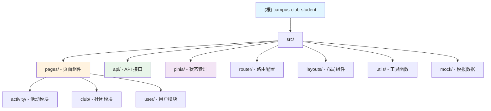

# 校园社团活动平台 - 学生端

> 最后更新：2026-01-04 17:31:33

## 变更记录 (Changelog)

### 2026-01-04
- 初始化 AI 上下文文档
- 完成项目架构分析与模块识别
- 生成模块索引与使用指南

---

## 项目愿景

校园社团活动平台（学生端）是一个基于 **Vue 3 + Vite + Element Plus** 构建的现代化校园社团管理系统，为学生用户提供便捷的社团浏览、活动报名和个人中心功能。项目致力于提升学生参与校园社团活动的体验，简化社团申请与活动报名流程。

---

## 架构总览

### 技术栈

| 技术 | 版本 | 用途 |
|------|------|------|
| Vue.js | ^3.3.8 | 渐进式前端框架 |
| Vite | ^5.0.0 | 下一代前端构建工具 |
| Element Plus | ^2.13.0 | Vue 3 组件库 |
| Vue Router | ^4.6.4 | 官方路由管理器 |
| Pinia | ^3.0.4 | Vue 3 状态管理 |
| Axios | ^1.13.2 | HTTP 客户端 |
| @element-plus/icons-vue | ^2.3.2 | Element Plus 图标库 |

### 项目特点

- **响应式设计**：适配桌面端与移动端
- **路由守卫**：基于 Token 的身份认证
- **统一请求拦截**：自动注入 Authorization 头
- **错误处理**：统一处理 401/403/500 等状态码
- **开发代理**：Vite proxy 解决跨域问题

---

## 模块结构图



---

## 模块索引

| 模块 | 路径 | 职责 | 语言 | 状态 |
|------|------|------|------|------|
| **用户认证** | `src/pages/` | 用户登录、注册、个人信息管理 | Vue 3 | ✅ 已完成 |
| **社团管理** | `src/pages/club/` | 社团列表、详情、申请、我的社团 | Vue 3 | ✅ 已完成 |
| **活动管理** | `src/pages/activity/` | 活动列表、详情、报名管理 | Vue 3 | ✅ 已完成 |
| **API 层** | `src/api/` | 统一的 HTTP 请求封装 | JavaScript | ✅ 已完成 |
| **状态管理** | `src/pinia/` | 用户状态（Token、用户信息） | JavaScript | ✅ 已完成 |
| **路由层** | `src/router/` | 路由配置与守卫 | JavaScript | ✅ 已完成 |

---

## 运行与开发

### 环境要求

- Node.js >= 16.0.0
- npm >= 8.0.0

### 快速启动

```bash
# 1. 安装依赖
npm install

# 2. 启动开发服务器（端口：3000）
npm run dev

# 3. 构建生产版本
npm run build

# 4. 预览生产构建
npm run preview
```

### 开发服务器配置

开发服务器默认运行在 `http://localhost:3000`，通过 Vite proxy 代理后端 API：

- `/api/*` → `http://8.148.195.239:8080/api`
- `/club/*` → `http://8.148.195.239:8080/api`
- `/activity/*` → `http://8.148.195.239:8080/api`

---

## 测试策略

⚠️ **当前项目无测试覆盖**

项目中未发现测试文件（`*.spec.js`、`*.test.js`）。建议补充：

1. **单元测试**：使用 Vitest 测试工具函数和 Pinia store
2. **组件测试**：使用 @vue/test-utils 测试页面组件
3. **E2E 测试**：使用 Playwright/Cypress 测试关键用户流程

---

## 编码规范

### 代码风格

- **组件命名**：采用 PascalCase（如 `ClubList.vue`）
- **文件命名**：
  - 页面组件：PascalCase（如 `ActivityDetail.vue`）
  - 工具函数：camelCase（如 `request.js`）
- **API 命名**：使用 `export function` 导出命名函数

### Vue 3 最佳实践

- 使用 **Composition API**（`<script setup>`）
- 使用 `ref`/`reactive` 定义响应式数据
- 使用 `onMounted` 等生命周期钩子
- 避免直接修改 props，优先使用 `emit` 事件

### API 调用规范

```javascript
// 统一使用 src/api 目录下的封装函数
import { getClubList, joinClub } from '@/api/club'

// 使用 try-catch 处理异常
const fetchData = async () => {
  try {
    const res = await getClubList({ pageNum: 1, pageSize: 10 })
    // 处理响应数据
  } catch (error) {
    console.error('请求失败：', error)
  }
}
```

---

## AI 使用指引

### 关键路径快速定位

| 功能 | 文件路径 |
|------|---------|
| **登录逻辑** | `src/pages/Login.vue` |
| **路由守卫** | `src/router/index.js` |
| **用户状态** | `src/pinia/userStore.js` |
| **HTTP 拦截器** | `src/utils/request.js` |
| **社团 API** | `src/api/club.js` |
| **活动 API** | `src/api/activity.js` |

### 常见任务

#### 1. 新增页面

```bash
# 1. 在 src/pages/ 下创建页面组件
# 2. 在 src/router/index.js 中添加路由
# 3. 如需认证，设置 meta.requiresAuth: true
```

#### 2. 新增 API 接口

```javascript
// 在 src/api/ 对应模块中添加函数
export function newApi(data) {
  return request({
    url: '/api/new-endpoint',
    method: 'post',
    data
  })
}
```

#### 3. 修改后端地址

编辑 `vite.config.js` 中的 `server.proxy.target`

---

## 项目统计

- **总文件数**：约 50+ 文件（不含 node_modules）
- **主要语言**：Vue 3 (80%)、JavaScript (20%)
- **代码行数**：约 3000+ 行（估算）
- **模块数量**：6 个核心模块

---

## 常见问题 (FAQ)

### Q1: 如何解决跨域问题？

A: 项目已通过 `vite.config.js` 配置 proxy 代理，开发环境无需手动处理跨域。

### Q2: Token 存储在哪里？

A: Token 存储在 Cookie 中（通过 js-cookie），有效期 7 天。Pinia store 会同步缓存用户信息。

### Q3: 如何添加新的 Element Plus 组件？

A: 组件已全局注册，直接使用即可。图标需从 `@element-plus/icons-vue` 中导入。

---

## 相关资源

- [Vue 3 官方文档](https://cn.vuejs.org/)
- [Vite 官方文档](https://cn.vitejs.dev/)
- [Element Plus 官方文档](https://element-plus.org/)
- [Pinia 官方文档](https://pinia.vuejs.org/)
- [项目仓库](./)
