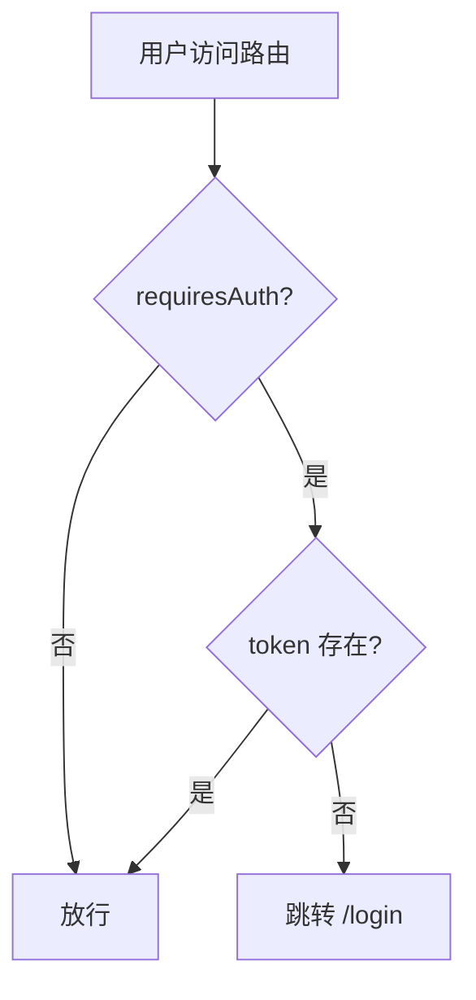

# router/ 路由配置目录

[src/](../CLAUDE.md) > **router/**

> 最后更新：2026-01-04 17:31:33

---

## 模块职责

`router/` 目录包含 Vue Router 配置和路由守卫，负责页面路由、权限控制和导航管理。

---

## 目录结构

```
router/
└── index.js           # 路由配置与守卫
```

---

## 入口与启动

### 路由初始化

在 `src/main.js` 中注册路由：

```javascript
import router from './router'

app.use(router)
```

---

## 对外接口

### 路由配置 (`index.js`)

```javascript
import { createRouter, createWebHistory } from 'vue-router'
import { useUserStore } from '@/pinia/userStore'
import Layout from '@/layouts/Layout.vue'

// 静态路由
const routes = [
  {
    path: '/',
    redirect: '/login'
  },
  {
    path: '/login',
    name: 'Login',
    component: () => import('@/pages/Login.vue'),
    meta: { title: '用户登录', requiresAuth: false }
  },
  {
    path: '/register',
    name: 'Register',
    component: () => import('@/pages/Register.vue'),
    meta: { title: '用户注册', requiresAuth: false }
  },
  // 登录后布局
  {
    path: '/home',
    name: 'Home',
    component: Layout,
    meta: { title: '首页', requiresAuth: true },
    children: [
      // 首页
      {
        path: '',
        component: () => import('@/pages/HomeIndex.vue')
      },
      // 社团管理
      {
        path: 'club/list',
        name: 'ClubList',
        component: () => import('@/pages/club/ClubList.vue'),
        meta: { title: '社团列表' }
      },
      {
        path: 'club/detail/:id',
        name: 'ClubDetail',
        component: () => import('@/pages/club/ClubDetail.vue'),
        meta: { title: '社团详情' }
      },
      {
        path: 'club/my',
        name: 'MyClub',
        component: () => import('@/pages/club/MyClub.vue'),
        meta: { title: '我的社团' }
      },
      {
        path: 'club/my/applications',
        name: 'MyClubApplication',
        component: () => import('@/pages/club/MyClubApplication.vue'),
        meta: { title: '我的社团申请' }
      },
      // 活动管理
      {
        path: 'activity/list',
        name: 'ActivityList',
        component: () => import('@/pages/activity/ActivityList.vue'),
        meta: { title: '活动列表' }
      },
      {
        path: 'activity/detail/:id',
        name: 'ActivityDetail',
        component: () => import('@/pages/activity/ActivityDetail.vue'),
        meta: { title: '活动详情' }
      },
      {
        path: 'activity/my-signups',
        name: 'MyActivitySignup',
        component: () => import('@/pages/activity/MyActivitySignup.vue'),
        meta: { title: '我的活动报名' }
      },
      // 用户信息
      {
        path: 'user/info',
        name: 'UserInfo',
        component: () => import('@/pages/user/UserInfo.vue'),
        meta: { title: '个人信息' }
      }
    ]
  }
]

// 创建路由实例
const router = createRouter({
  history: createWebHistory(),
  routes
})

// 路由守卫：拦截未登录访问
router.beforeEach((to, from, next) => {
  const userStore = useUserStore()
  // 设置页面标题
  if (to.meta.title) {
    document.title = to.meta.title + ' - 校园社团活动平台'
  }
  // 判断是否需要登录
  if (to.meta.requiresAuth) {
    if (userStore.token) {
      next()
    } else {
      next('/login') // 未登录跳转到登录页
    }
  } else {
    next()
  }
})

export default router
```

---

## 关键依赖与配置

### 依赖

- **vue-router** (^4.6.4)：Vue 3 官方路由管理器
- **@/pinia/userStore**：用户状态管理（Token）

### 路由模式

- **模式**：`createWebHistory()`（HTML5 History 模式）
- **基础 URL**：`/`（根路径）

### 路由元信息 (meta)

```javascript
meta: {
  title: string,         // 页面标题
  requiresAuth: boolean  // 是否需要认证
}
```

---

## 路由结构

### 公共路由（无需认证）

| 路径 | 组件 | 说明 |
|------|------|------|
| `/` | 重定向到 `/login` | 根路径 |
| `/login` | `Login.vue` | 用户登录 |
| `/register` | `Register.vue` | 用户注册 |

### 受保护路由（需要认证）

所有 `/home` 下的路由都需要登录（`requiresAuth: true`），分为：

#### 首页

| 路径 | 组件 |
|------|------|
| `/home` | `HomeIndex.vue` |

#### 社团管理

| 路径 | 命名路由 | 组件 |
|------|----------|------|
| `/home/club/list` | `ClubList` | `ClubList.vue` |
| `/home/club/detail/:id` | `ClubDetail` | `ClubDetail.vue` |
| `/home/club/my` | `MyClub` | `MyClub.vue` |
| `/home/club/my/applications` | `MyClubApplication` | `MyClubApplication.vue` |

#### 活动管理

| 路径 | 命名路由 | 组件 |
|------|----------|------|
| `/home/activity/list` | `ActivityList` | `ActivityList.vue` |
| `/home/activity/detail/:id` | `ActivityDetail` | `ActivityDetail.vue` |
| `/home/activity/my-signups` | `MyActivitySignup` | `MyActivitySignup.vue` |

#### 用户管理

| 路径 | 命名路由 | 组件 |
|------|----------|------|
| `/home/user/info` | `UserInfo` | `UserInfo.vue` |

---

## 路由守卫

### 全局前置守卫

```javascript
router.beforeEach((to, from, next) => {
  const userStore = useUserStore()

  // 1. 设置页面标题
  if (to.meta.title) {
    document.title = to.meta.title + ' - 校园社团活动平台'
  }

  // 2. 权限控制
  if (to.meta.requiresAuth) {
    if (userStore.token) {
      next() // 已登录，放行
    } else {
      next('/login') // 未登录，跳转登录页
    }
  } else {
    next() // 公共路由，直接放行
  }
})
```

### 守卫逻辑流程



---

## 使用方式

### 编程式导航

```javascript
import { useRouter } from 'vue-router'

const router = useRouter()

// 路径跳转
router.push('/home/club/list')

// 命名路由跳转
router.push({ name: 'ClubDetail', params: { id: 1 } })

// 带查询参数
router.push({
  path: '/home/activity/list',
  query: { keyword: '音乐', clubId: 5 }
})

// 替换当前路由（不留下历史记录）
router.replace('/login')

// 后退/前进
router.go(-1)
router.go(1)
```

### 获取路由参数

```javascript
import { useRoute } from 'vue-router'

const route = useRoute()

// 获取路径参数（/club/detail/:id）
const clubId = route.params.id

// 获取查询参数（?keyword=音乐）
const keyword = route.query.keyword

// 获取路由元信息
const title = route.meta.title
```

---

## 测试与质量

⚠️ **当前无测试覆盖**

建议补充路由测试：

```javascript
// 使用 Vitest 测试路由
import { describe, it, expect } from 'vitest'
import { createRouter, createWebHistory } from 'vue-router'
import { useUserStore } from '@/pinia/userStore'

describe('Router', () => {
  it('redirects to login when not authenticated', async () => {
    const router = createRouter({
      history: createWebHistory(),
      routes: [/* ... */]
    })

    // 清除 Token
    const userStore = useUserStore()
    userStore.logout()

    // 尝试访问受保护路由
    await router.push('/home/club/list')

    // 应跳转到登录页
    expect(router.currentRoute.value.path).toBe('/login')
  })
})
```

---

## 常见问题 (FAQ)

### Q1: 如何添加新路由？

1. 在 `pages/` 创建页面组件
2. 在 `router/index.js` 的 `routes` 数组中添加路由配置
3. 如需认证，设置 `meta: { requiresAuth: true }`
4. 在侧边栏（`Layout.vue`）添加菜单项（如需）

### Q2: 路由懒加载是如何实现的？

使用动态导入（`import()`）：

```javascript
component: () => import('@/pages/club/ClubList.vue')
```

这样会将每个页面打包成单独的 chunk，实现按需加载，减少首屏加载时间。

### Q3: 如何实现权限控制（如管理员）？

扩展路由守卫：

```javascript
router.beforeEach((to, from, next) => {
  const userStore = useUserStore()

  if (to.meta.requiresAdmin && userStore.userInfo.role !== 'admin') {
    next('/home') // 非管理员跳转首页
  } else {
    next()
  }
})
```

---

## 相关文件清单

- `src/main.js` - 路由实例注册
- `src/pinia/userStore.js` - 用户状态（Token）
- `src/layouts/Layout.vue` - 主布局（侧边栏菜单）
- `src/pages/` - 所有页面组件

---

## 变更记录 (Changelog)

### 2026-01-04
- 初始化路由模块文档
- 梳理所有路由配置和守卫逻辑
- 补充使用示例和测试建议
